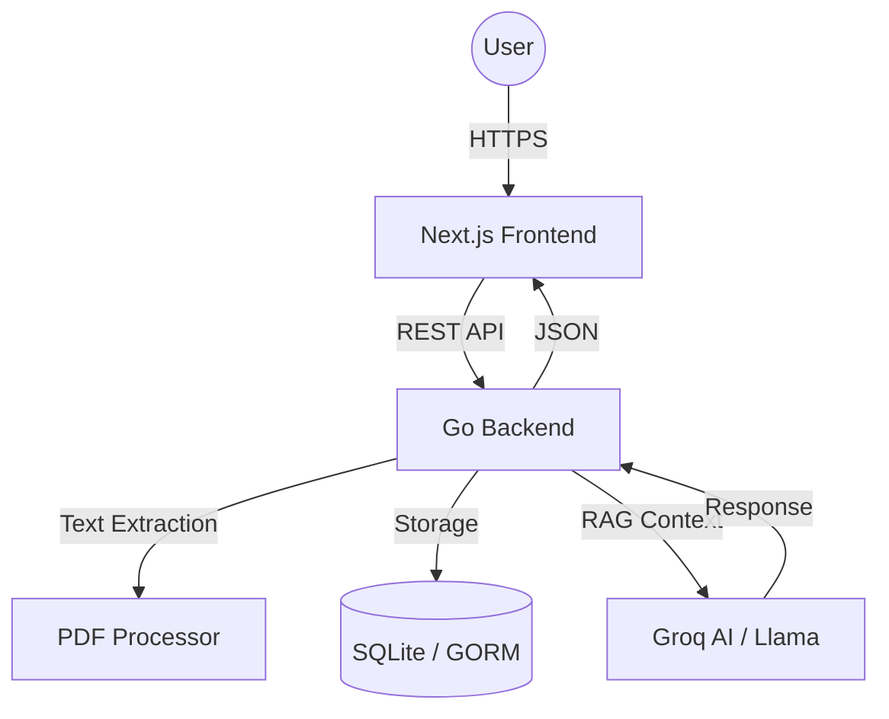
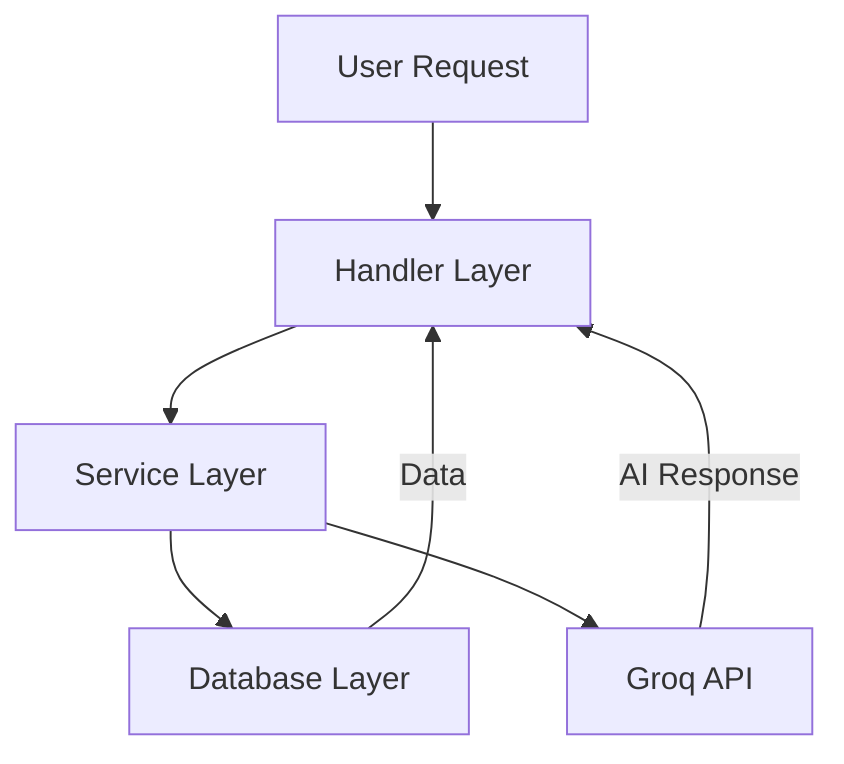
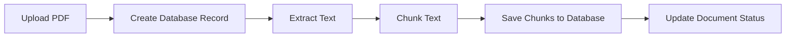
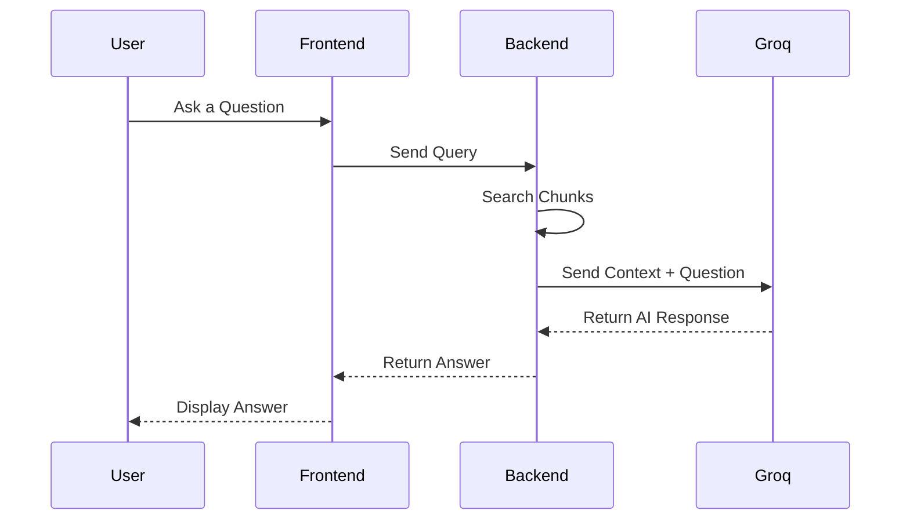

# Azeru - Enterprise Brain

Azeru is a cutting-edge, AI-driven document intelligence platform designed to transform your PDFs into actionable knowledge. By leveraging advanced Retrieval-Augmented Generation (RAG) techniques, Azeru provides precise answers based on your private documents, making it an indispensable tool for enterprises and professionals.

## Features

- **PDF Intelligence**: Upload and process PDF documents seamlessly, extracting valuable insights.
- **Automated Text Extraction**: Intelligent chunking and text extraction for optimal context retrieval.
- **RAG-Powered Chat**: Engage in meaningful conversations with your documents using Llama-powered AI (via Groq).
- **Bring Your Own Key (BYOK)**: Ensure enhanced security and cost management by using your own Groq API keys.
- **Enterprise-Ready Architecture**: Built with a scalable Go backend and a modern Next.js frontend.
- **Customizable Search**: Supports both keyword-based and vector-based search methods for document queries.

## Architecture

Azeru follows a modern decoupled architecture consisting of a high-performance Go backend and a responsive Next.js frontend. The system is built around the "Enterprise Brain" concept, focusing on document intelligence and Retrieval-Augmented Generation (RAG).

### High-Level Overview



### Backend Flow

The backend is organized following clean architecture principles within the `internal/` directory to ensure encapsulation and maintainability.



### Document Processing Pipeline

1. **Ingestion**: The `UploadDocument` handler receives the file and creates a record in the database with a `processing` status.
2. **Text Extraction**: The `PDFProcessor` service extracts text asynchronously.
3. **Chunking**: The extracted text is split into smaller, overlap-aware chunks for better context retrieval.
4. **Persistence**: Chunks are saved to the database, and the document status is updated to `completed`.



### RAG Execution (Chat)

1. **Search**: The system performs a search in the `chunks` table (supports both keyword-based and vector-based search).
2. **Context Assembly**: Top relevant chunks are retrieved and formatted as context.
3. **AI Inference**: A prompt is constructed taking the Context and User Question.
4. **BYOK Flow**: The user's provided API key is used for the request to Groq, ensuring privacy and usage control.
5. **Response**: The AI response is saved to chat history and returned to the user.



## Technology Stack

### Backend

- **Language**: Go 1.25+
- **Framework**: [Gin](https://github.com/gin-gonic/gin) (HTTP Web Framework)
- **ORM**: [GORM](https://gorm.io/) with SQLite
- **AI Integration**: [Groq](https://groq.com/) (Llama 3/4 Models)
- **Database**: SQLite for lightweight and efficient data storage
- **Vector Search**: ChromaDB
- **Embeddings**: Ollama (`nomic-embed-text`)

### Frontend

- **Framework**: [Next.js](https://nextjs.org/) (React)
- **Language**: TypeScript
- **Styling**: CSS Modules for scoped and maintainable styles

## Project Structure

```text
azeru/
├── backend/            # Go Backend Service
│   ├── cmd/            # Application entry points
│   ├── internal/       # Private library code (handlers, services, models)
│   └── data/           # SQLite database storage
├── frontend/           # Next.js Frontend
│   └── app/            # Source code for the web app
├── docker/             # Docker configuration and scripts
├── docker-compose.yml  # Docker Compose setup
└── README.md           # Project documentation
```

## Getting Started

### Prerequisites

To run Azeru, ensure you have the following installed:

- Docker & Docker Compose (recommended approach)
- If installing manually:
  - Go (1.25 or later)
  - Node.js (v18 or later)
  - Ollama (installed locally, with `nomic-embed-text` model pulled)
  - ChromaDB (running locally on port 8000)

### Easy Installation (Docker)

1. **Clone the Repository**:

   ```bash
   git clone https://github.com/your-repo/azeru.git
   cd azeru
   ```

2. **Start Services**:

   ```bash
   docker-compose up -d
   ```

3. **Pull Embedding Model (first time only)**:

   ```bash
   docker exec azeru-ollama ollama pull nomic-embed-text
   ```

4. **Access the Application**:
   Open a browser and navigate to `http://localhost:3000`.

### Manual Setup

1. **Clone the Repository**:

   ```bash
   git clone https://github.com/your-repo/azeru.git
   cd azeru
   ```

2. **Start Infrastructure Dependencies**:
   Ensure you have Ollama running locally. Pull the required model:

   ```bash
   ollama pull nomic-embed-text
   ```

   Start ChromaDB so it is accessible at `http://localhost:8000`.

3. **Backend Setup**:

   ```bash
   cd backend
   go mod download
   ```

   Create a `.env` file in the `backend` directory if necessary (or rely on defaults).

   ```bash
   go run cmd/server/main.go
   ```

   The backend will start on `http://localhost:8080`.

4. **Frontend Setup**:
   ```bash
   cd ../frontend
   npm install
   ```
   Create a `.env.local` or `.env` file if necessary.
   ```bash
   npm run dev
   ```
   The frontend will start on `http://localhost:3000`.

### Usage

1. **Upload Documents**: Open the application at `http://localhost:3000`. Navigate to the upload section and select PDF files to upload. Wait for the extraction and embedding generation to complete.
2. **Setup AI Connection**: Have your Groq API key ready.
3. **Chat with Documents**: Head to the chat interface. Enter your Groq API key when prompted, then ask questions. The system will retrieve relevant chunks via vector search or keyword-based fallback and generate an AI-powered answer.

## Contributing

We welcome contributions! Please review our [CONTRIBUTING.md](CONTRIBUTING.md) for information on how to get started, set up your development environment, run tests, and submit pull requests.

## License

Azeru is licensed under the MIT License. See the [LICENSE](LICENSE) file for details.

---

For more information, visit our documentation or contact us at support@azeru.com.
