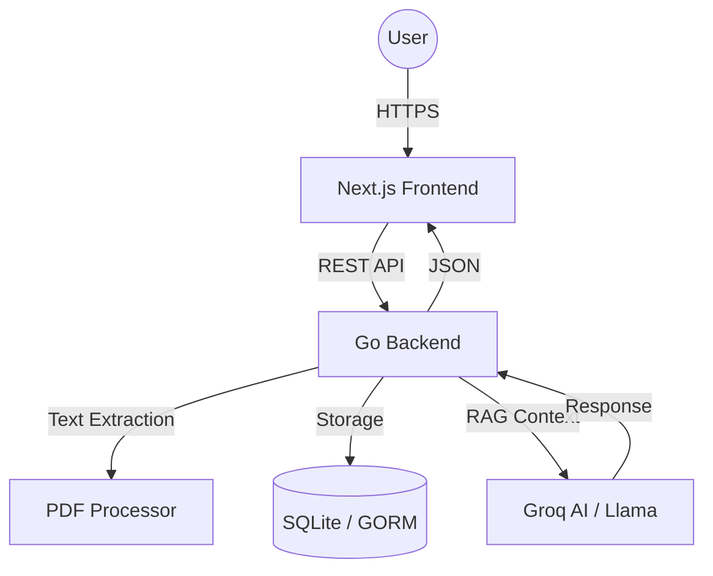
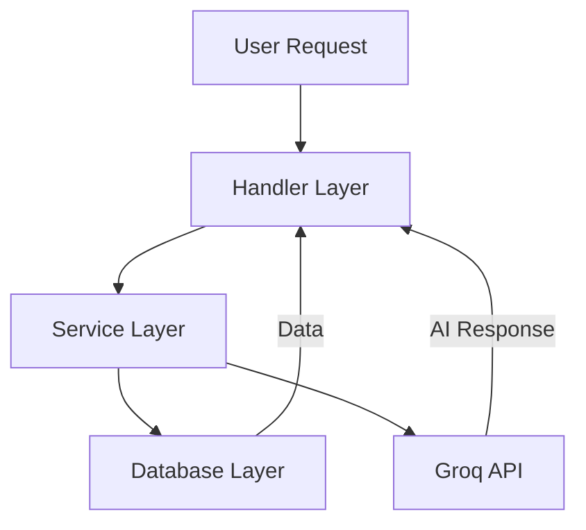
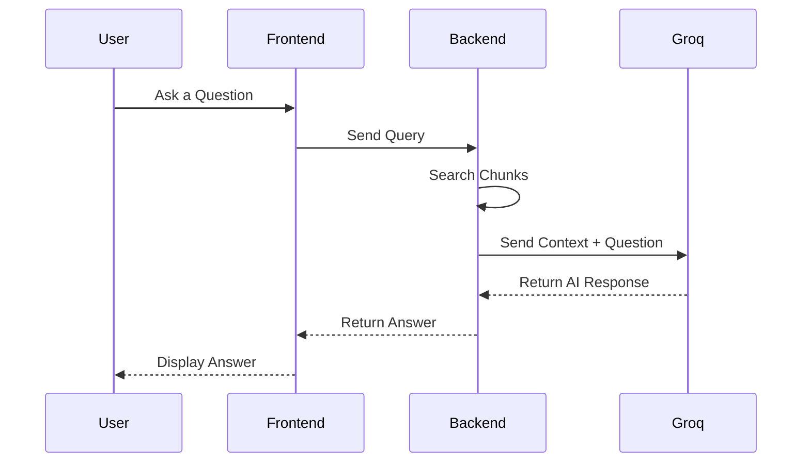

# System Architecture - Azeru

Azeru follows a modern decoupled architecture consisting of a high-performance **Go backend** and a responsive **Next.js frontend**. The system is built around the "Enterprise Brain" concept, focusing on document intelligence and Retrieval-Augmented Generation (RAG).

## 🌍 High-Level Overview

The following diagram illustrates the high-level architecture of Azeru:

### Key Components

1. **Frontend**: A Next.js application that provides an intuitive user interface for uploading documents, chatting, and managing data.
2. **Backend**: A Go-based server that handles API requests, processes documents, and communicates with external AI services.
3. **Database**: SQLite is used for lightweight and efficient data storage.
4. **AI Integration**: Groq's Llama models are used for generating intelligent responses.

## 🏗️ Backend Architecture (Go)

The backend is organized following clean architecture principles within the `internal/` directory to ensure encapsulation and maintainability.

### Layers

- **Cmd (`cmd/server`)**: Entry point of the application. Handles initialization and server startup.
- **Handlers (`internal/handlers`)**: The interface layer. Maps HTTP routes to business logic, handles request validation, and formats JSON responses.
- **Services (`internal/services`)**: Contains core business logic:
  - `GroqClient`: Manages communication with the Groq API.
  - `PDFProcessor`: Handles text extraction and chunking.
- **Models (`internal/models`)**: Defines data structures for the database (Documents, Chunks, ChatMessages).
- **Database (`internal/db`)**: Manages the GORM connection and data persistence using SQLite.

### Backend Flow Diagram

## 📜 Document Processing Pipeline

When a user uploads a PDF, the system processes it through the following steps:

1. **Ingestion**: The `UploadDocument` handler receives the file and creates a record in the database with a `processing` status.
2. **Text Extraction**: The `PDFProcessor` service extracts text asynchronously.
3. **Chunking**: The extracted text is split into smaller, overlap-aware chunks for better context retrieval.
4. **Persistence**: Chunks are saved to the database, and the document status is updated to `completed`.

### Pipeline Flowchart

## 💬 RAG Execution (Chat)

When a user asks a question, the system performs the following steps:

1. **Search**: The system performs a search in the `chunks` table (supports both keyword-based and vector-based search).
2. **Context Assembly**: Top relevant chunks are retrieved and formatted as context.
3. **AI Inference**: A prompt is constructed: `[Context] + [Question]`.
4. **BYOK Flow**: The user's provided API key is used for the request to Groq, ensuring privacy and usage control.
5. **Response**: The AI response is saved to chat history and returned to the user.

### Chat Flow Diagram

---

This architecture ensures scalability, maintainability, and a seamless user experience. For further details, refer to the source code and documentation.
